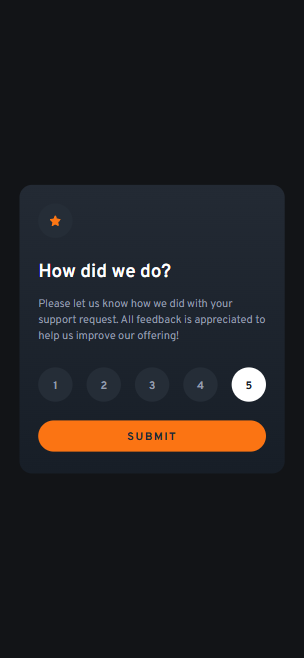
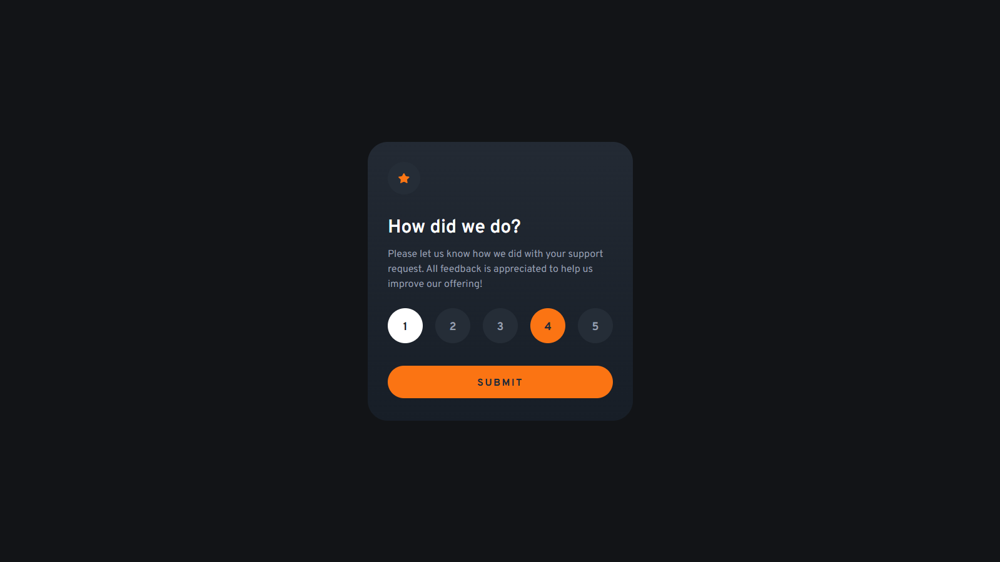
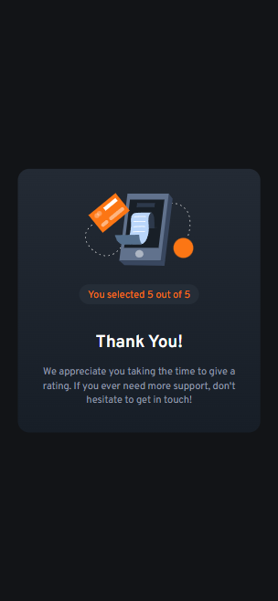
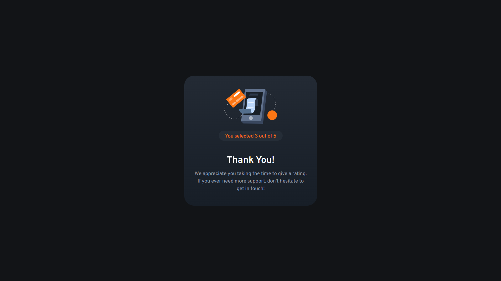

# Frontend Mentor - Interactive Rating Component

[](https://html.spec.whatwg.org/)
[](https://tailwindcss.com/)
[](https://developer.mozilla.org/en-US/docs/Web/JavaScript)

This is my solution to the [Interactive Rating Component challenge on Frontend Mentor](https://www.frontendmentor.io/challenges/interactive-rating-component-koxpeBUmI). The project simulates a user rating experience using a simple and interactive UI component.

The entire layout is built using **semantic HTML** and **Tailwind CSS**, with dynamic visual feedback for user interaction. I customized the project structure and component styling to ensure clarity, accessibility, and responsiveness across devices.

## Table of Contents

- [Overview](#overview)
  - [The Challenge](#the-challenge)
  - [Screenshots](#screenshots)
  - [Links](#links)
- [How to Use](#how-to-use)
- [My Process](#my-process)
  - [Built With](#built-with)
  - [What I Practiced](#what-i-practiced)
  - [Continued Development](#continued-development)
  - [Useful Resources](#useful-resources)
- [Author](#author)
- [Acknowledgments](#acknowledgments)

## Overview

### The Challenge

Users should be able to:

- Select a rating from 1 to 5
- Submit the rating and see a thank you state
- View hover and focus states for all interactive elements
- Experience a fully responsive layout on both mobile and desktop

### Screenshots

| 📱 Mobile View | 🖥️ Desktop View |
|----------------|-----------------|
|  |  |
|  |  |

<p align="center"><em>Screenshots from the final implementation of the rating component.</em></p>

> 💡 Make sure you place your screenshots inside a `screenshots/` folder in your repo so that they render correctly here.

### Links

- **Live Site:** https://interactive-rating-beryl.vercel.app/
- **GitHub Repository:** [https://github.com/VitorHFCorrea/frontend-mentor](https://github.com/VitorHFCorrea/frontend-mentor)

## How to Use

To run this project locally:

1. **Clone the repository:**
   ```bash
   git clone https://github.com/VitorHFCorrea/frontend-mentor.git
   ```

2. **Navigate to the project folder:**
   ```bash
   cd frontend-mentor/Challenges/Newbie/interactive-rating
   ```

3. **Build the Tailwind CSS file:**
   ```bash
   npx tailwindcss -i ./src/assets/css/input.css -o ./src/assets/css/output.css --watch
   ```

4. **Open `index.html` in your browser.**

> No build tools or frameworks are required beyond Tailwind CLI.

## My Process

### Built With

- **Semantic HTML5**
- **Tailwind CSS 4.1**
- **JavaScript**
- **Responsive Design (Mobile-First)**
- **Flexbox**

### What I Practiced

- Handling conditional visual states (e.g., selected rating)
- Creating accessible buttons and input states
- Using Tailwind for hover, focus, and transition effects
- Responsive layout design and component modularity

### Useful Resources

- [Tailwind CSS Documentation](https://tailwindcss.com/docs) – My primary reference for all utility classes
- [Frontend Mentor](https://www.frontendmentor.io/) – Provided the layout, user story, and design constraints

## Author

- GitHub – [@VitorHFCorrea](https://github.com/VitorHFCorrea)
- Frontend Mentor – [@VitorHFCorrea](https://www.frontendmentor.io/profile/VitorHFCorrea)

## Acknowledgments

Thanks to [Frontend Mentor](https://www.frontendmentor.io/) for the challenge and community. This was a great opportunity to practice styling, layout, and component UX.

> Feedback is welcome! Feel free to open issues or pull requests with suggestions.
