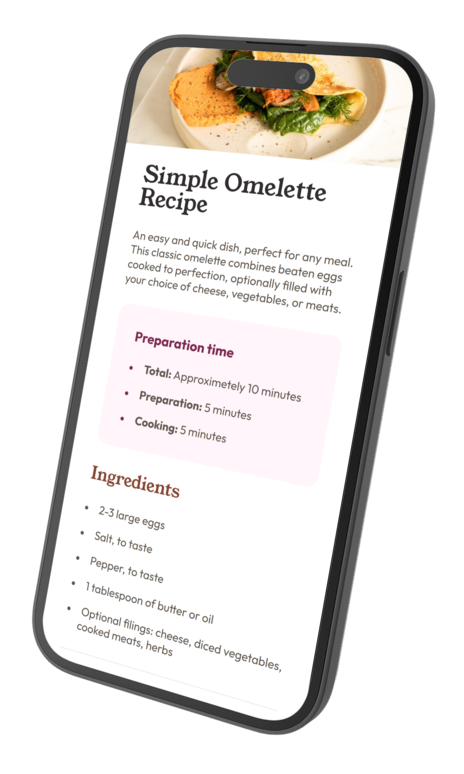
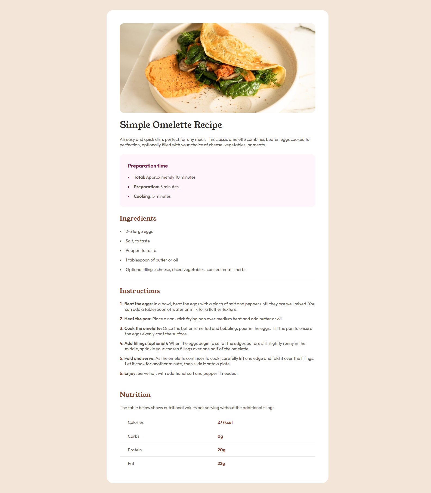

# Frontend Mentor - Recipe Page

[](https://html.spec.whatwg.org/)
[](https://www.w3.org/Style/CSS/Overview.en.html)

This is my solution to the [Recipe Page challenge on Frontend Mentor](https://www.frontendmentor.io/challenges/recipe-page-KiTsR8QQKm). Frontend Mentor challenges help you improve your coding skills by building realistic projects.

## Table of Contents

- [Overview](#overview)
  - [The Challenge](#the-challenge)
  - [Screenshots](#screenshots)
  - [Links](#links)
- [My Process](#my-process)
  - [Built With](#built-with)
  - [What I Practiced](#what-i-practiced)
- [Author](#author)

## Overview

Users should be able to:

- View the recipe page on mobile and desktop
- See a clean, accessible layout
- Read all recipe information including ingredients, instructions, and nutrition facts

This project is focused on building semantic HTML structure and using modern CSS to style a responsive layout.

---

### Screenshots 📸

| 📱 Mobile View (Mockup) | 🖥️ Desktop View (Full Page) |
|----------------------|--------------------------|
|  |  |

<p align="center"><em>Click the image to view it in full size and read the details clearly.</em></p>

> 💡 Make sure you place your screenshots inside a `screenshots/` folder in your repo so that they render correctly here.

### Links

- Live Site (Github Pages): https://vitorhfcorrea.github.io/Recipe-Page
- GitHub Repository: https://github.com/VitorHFCorrea/Recipe-Page

## How to Use

To view the project locally on your machine:

1. **Clone the repository:**
  ```bash
  git clone https://github.com/VitorHFCorrea/frontend-mentor.git
  ```

2. **Navigate to the project folder:**
  ```bash
  cd frontend-mentor/Challenges/Newbie/social-links-profile
  ```

3. **Open index.html in your browser to view the site.**

## My Process

### Built With

- Semantic **HTML5**
- **CSS** custom properties
- Flexbox
- Responsive design
- Mobile-first workflow

### What I Practiced

While building this project, I practiced:

- Semantic structure in HTML
- Organizing styles using a clean and scalable CSS approach
- Responsiveness using media queries
- Accessibility best practices
- Following a design spec closely

## Author

- GitHub – [@VitorHFCorrea](https://github.com/VitorHFCorrea)
- Frontend Mentor – [@VitorHFCorrea](https://www.frontendmentor.io/profile/VitorHFCorrea)

> This project is part of my ongoing learning journey as a front-end developer. Feedback is always welcome!