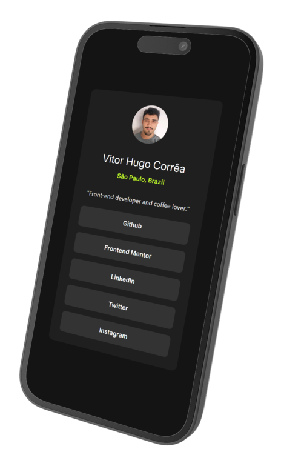

# Frontend Mentor - Social Links Profile

[](https://html.spec.whatwg.org/)
[](https://tailwindcss.com/)

This is my solution to the [Social Links Profile challenge on Frontend Mentor](https://www.frontendmentor.io/challenges/social-links-profile-UG32l9m6dQ). It's a simple and responsive profile card built using semantic HTML and Tailwind CSS.

In this version, I personalized the project with **my own name, location, photo, and social media links**, turning the generic layout into a fully customized profile card.

## Table of Contents

- [Overview](#overview)
  - [The challenge](#the-challenge)
  - [Screenshot](#screenshot)
  - [Links](#links)
- [How to Use](#how-to-use)
- [My Process](#my-process)
  - [Built With](#built-with)
  - [What I Practiced](#what-i-practiced)
  - [Continued Development](#continued-development)
  - [Useful Resources](#useful-resources)
- [Author](#author)
- [Acknowledgments](#acknowledgments)

## Overview

Users should be able to:

- View a social profile card component
- See hover and focus states for all interactive elements
- Use the site on both desktop and mobile screens

### Screenshot

| 📱 Mobile View (Mockup) | 🖥️ Desktop View (Full Page) |
|----------------------|--------------------------|
|  |  |

<p align="center"><em>Click the image to view it in full size and read the details clearly.</em></p>

> 💡 Make sure you place your screenshots inside a `screenshots/` folder in your repo so that they render correctly here.

### Links

- Live Site (Github Pages): https://github.com/VitorHFCorrea/frontend-mentor/tree/main/Challenges/Newbie/social-links-profile
- GitHub Repository: https://vitorhfcorrea.github.io/frontend-mentor/Challenges/Newbie/social-links-profile/

## How to Use

To run this project locally on your machine:

1. **Clone the repository:**
  ```bash
  git clone https://github.com/VitorHFCorrea/frontend-mentor.git
  ```

2. **Navigate to the project folder:**
  ```bash
  cd frontend-mentor/Challenges/Newbie/social-links-profile
  ```

3. **Install dependencies:**
  ```bash
  npm install
  ```

4. **Build the Tailwind CSS output:**
  ```bash
  npx tailwindcss -i ./input.css -o ./output.css --watch
  ```

5. **Open index.html in your browser to view the site.**

## My Process

### Built With

- Semantic **HTML5**
- **Tailwind CSS 4.1** (via CLI)
- Flexbox
- Responsive design
- Mobile-first workflow

### What I Practiced

- Utility-first CSS with Tailwind
- Layout structuring with `flex`, `gap`, and responsive sizing
- Custom colors and fonts via Tailwind configuration
- Managing hover and transition effects with Tailwind classes
- Responsiveness using Tailwind

```html
<a class="hover:bg-mygreen hover:text-mygrey-900 transition-colors">
  GitHub
</a>
```

```css
/* Custom colors used via Tailwind config */
--color-mygreen: hsl(75, 94%, 57%);
```

## Useful Resources
**Tailwind CSS Docs:** My go-to resource for understanding utility classes and responsive behavior.

**Frontend Mentor Challenge Page:** Provided the design and user story that guided development.

## Author

- GitHub – [@VitorHFCorrea](https://github.com/VitorHFCorrea)
- Frontend Mentor – [@VitorHFCorrea](https://www.frontendmentor.io/profile/VitorHFCorrea)

> This project is part of my ongoing learning journey as a front-end developer. Feedback is always welcome!